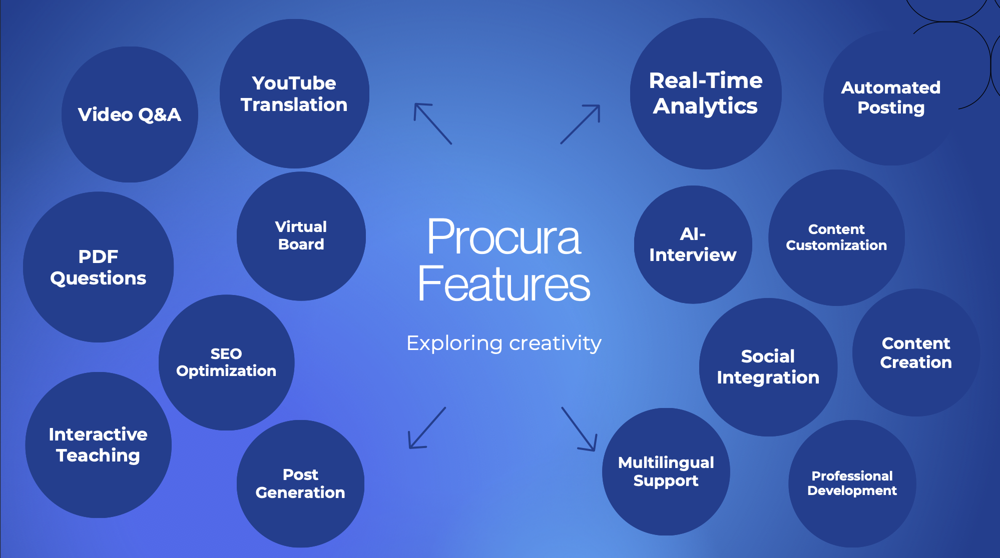
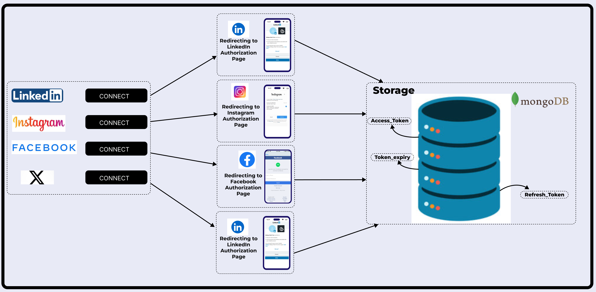
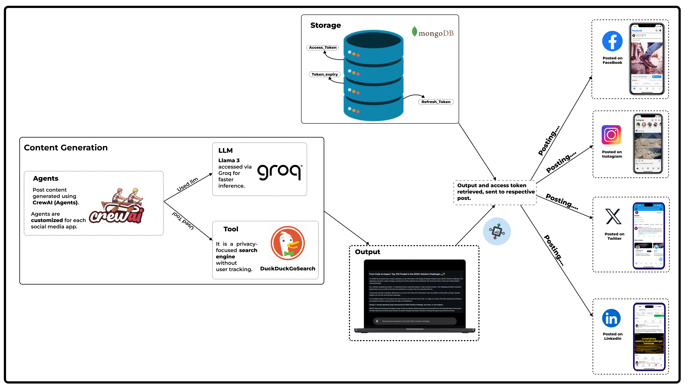
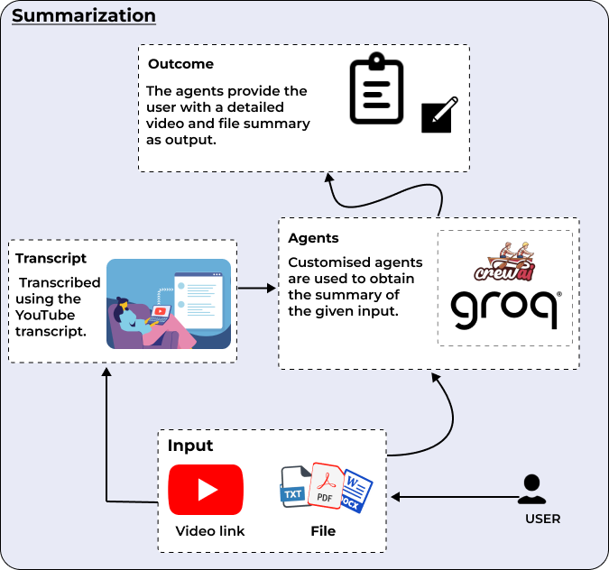
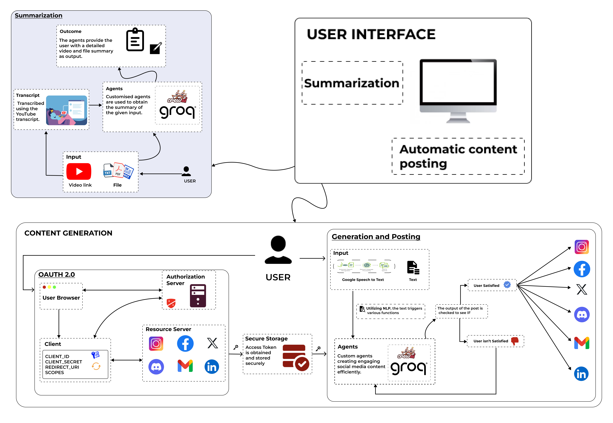
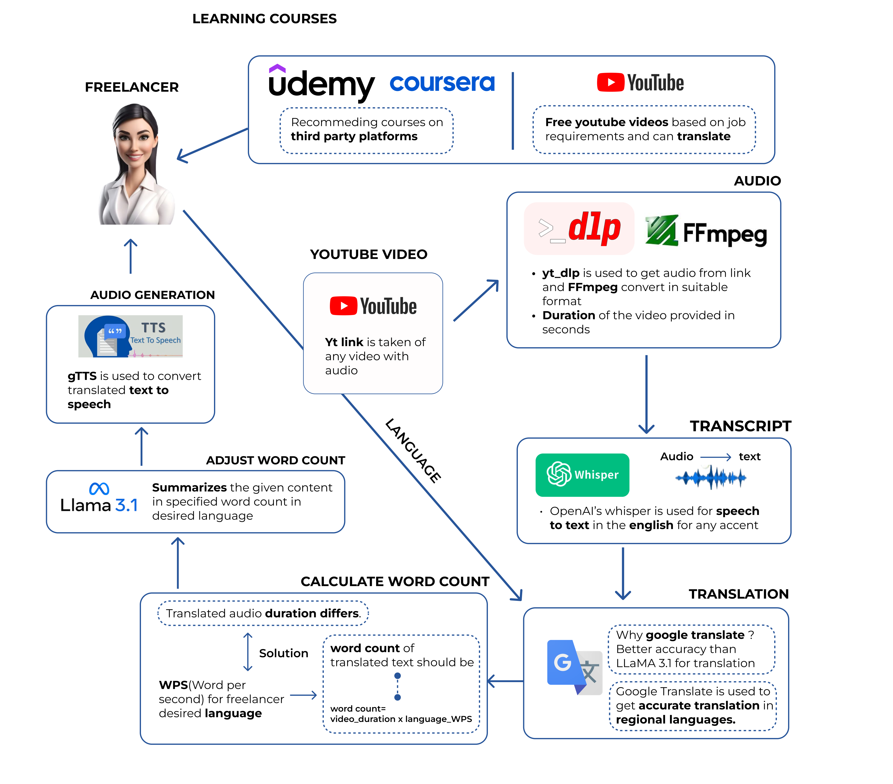
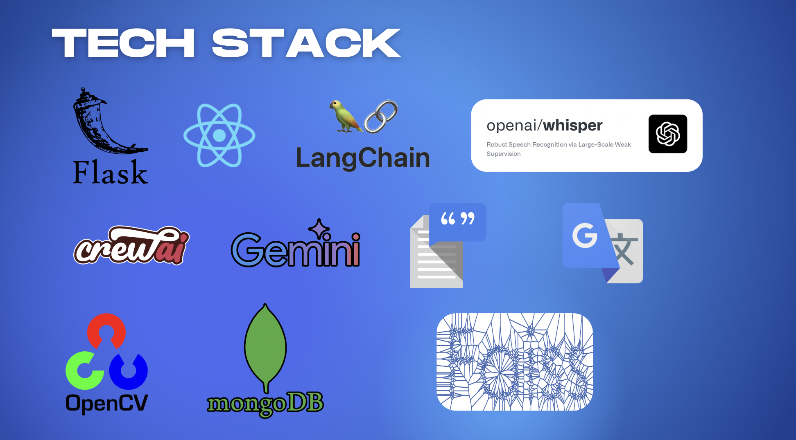

# EduSage - AI-Powered Learning Platform

EduSage is a comprehensive, AI-driven educational platform designed to enhance independent learning for students. The platform leverages cutting-edge technologies like Whisper for transcription, Gemini for AI-powered question generation, Mediapipe for real-time interactive sessions, and more. EduSage empowers students to translate and interact with educational content, receive tailored feedback, and engage in virtual classrooms, all while ensuring a seamless, scalable, and secure experience.


# Features EduSage Provide



### In Depth Working 

1. **Authorization(OAUTH 2.0):**

    
    - Users authorize social accounts, ensuring privacy by excluding credentials storage.
    - Access tokens enable seamless actions without repeated user re-authorization.
    - Tokens stored in MongoDB, maintaining access while protecting credentials.
   - Automated management enables secure posting, prioritizing privacy.

2. **Content Generation:**

     
    - Agents use CrewAI technology, supported by Llama 3 and DuckDuckGo, to generate posts.
    - Tokens are securely stored in MongoDB for authentication.
    - Posts are automated across Facebook, Instagram, Twitter, and LinkedIn.

3. **Summarization:**

    
    - EduSage automatically generates announcements and posts for Discord servers.
    - When a YouTube video is uploaded and linked to Discord, it triggers the post creation.
    - The video is converted into a post specifically tailored for the Discord community.

4. **Architecture(Content Posting and Summarization) :**

    
    - Users input files or links for content summarization by agents.
    - OAuth 2.0 securely manages authorization, safeguarding user privacy and tokens.
    - NLP processes text, enabling automated social media content generation.
    - Users review generated content before posting across chosen social platforms.

5. **Youtube translation and Q&A:**

    
    - YouTube audio is extracted, formatted, and duration noted in seconds.
    - Whisper transcribes audio to text, supporting various accents and languages
    - Translated text is converted to audio using Google Text-to-Speech.
   
6. **Chat With PDF:**

   
    - User inputs a PDF and asks questions via text/audio.
    - PDF data is stored as nodes and vectors for searches.
    - Neo4j graph and vector searches retrieve context based on questions.
    - Llama 3.1 generates responses from retrieved context for user display.

7. **Question Generation and Answer Evaluation:**

   
    - User uploads a PDF, specifying required question quantity and types.
    - PyPDF2 extracts PDF text, divided into chunks by LangChain splitter.
    - Llama 3.1 generates questions from chunks using Retrieval-Augmented Generation.
    - Retrieved questions display on the front end for user interaction.

8. **Virtual Board:**

   
    - The camera captures video frames to detect hand presence and gestures.
    - Finger positions and gestures are identified using MediaPipe and OpenCV.
    - Captured frames are processed by Gemini LLM for mathematical solutions.

### Technologies Used



1. **Whisper** - For speech-to-text transcription of videos.
2. **Gemini** - AI-powered question generation and content tailoring.
3. **Mediapipe** - Real-time video analytics and interactive features during virtual lessons.
5. **Flask** - Backend web framework.
7. **MongoDB** - Database for storing user data and reports.
10. **React** - Front End.
11. **Google Translate** - For Multilingual Support.
12. **Open CV** - For Image processing.

### Installation

1. **Clone the Repository:**
   ```bash
   git clone https://github.com/Daniel-Das-k/EduSage.git
   cd EduSage/backend/
   ```

2. **Create a Virtual Environment:**
   ```bash
   python3 -m venv EduSage
   source EduSage/bin/activate   # On Windows: `env\Scripts\activate`
   ```

3. **Install Dependencies:**
   ```bash
   pip install -r requirements.txt
   ```

4. **Set Up Environment Variables:**
   Create a `.env` file in the root directory with the necessary API keys and configuration settings.

5. **front-end Application:**
   ```bash
   cd client
   npm i 
   npm run dev
   ```

6. **Back-end Application:**
    ```bash
   cd backend
   python app.py
   ```

7. **Access the Application:**
   Open your browser and navigate to `http://127.0.0.1:5000/`.

### Usage

- **Upload Documents:** Students can upload documents to receive AI-generated questions and feedback.
- **Transcribe and Translate Videos:** Students can input YouTube video links, and the platform will transcribe, translate, and sync audio playback.
- **Join Virtual Classes:** Teachers and students can connect via virtual meetings for interactive learning sessions.

### Future Opportunities

1. **Expanded Language Support** for transcription and translation.
2. **AI-Powered Personalization** for tailored learning experiences.
3. **Mobile App Development** for on-the-go learning.
4. **LMS Integration** to streamline educational workflows.
5. **Gamification Features** to boost student engagement.